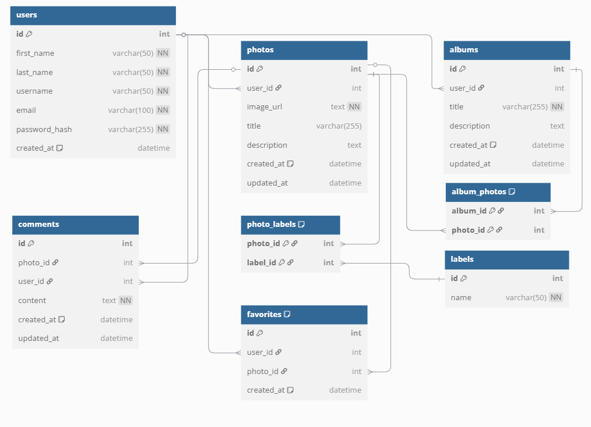
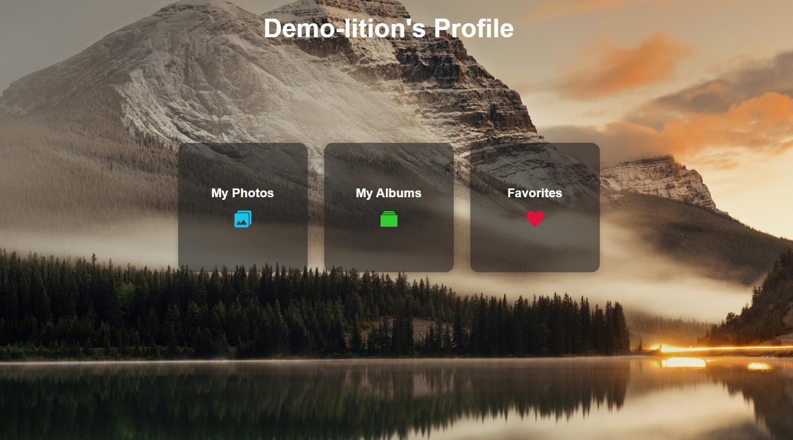
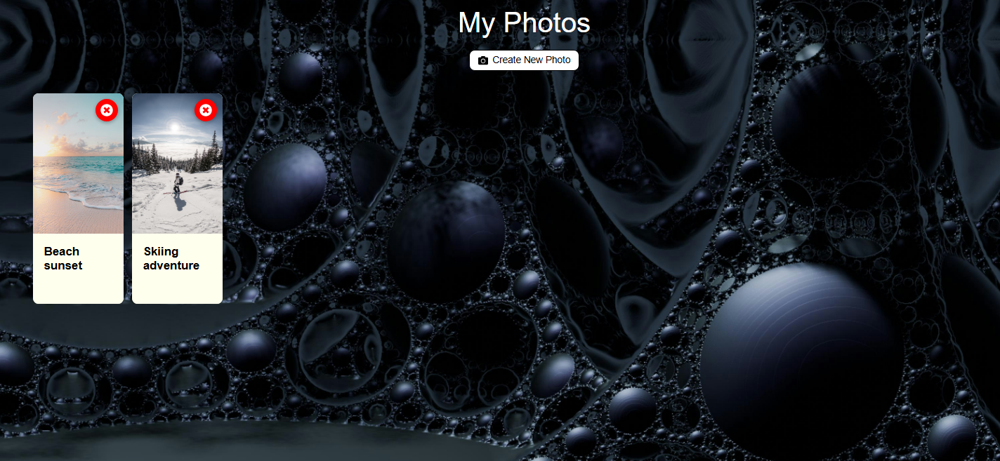
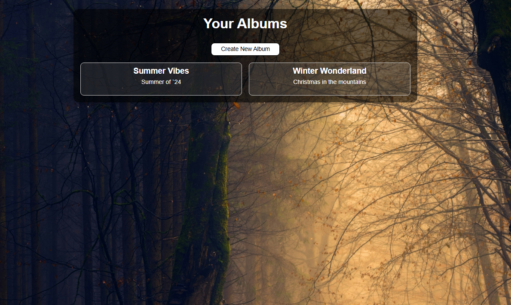
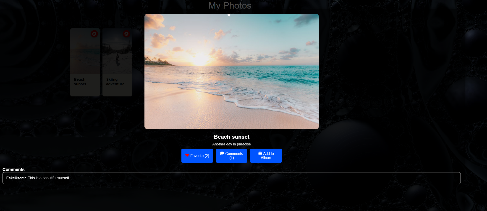

# 📸 Glint: A Photo-Sharing Web App

### 🔗 [Visit Live Site](https://glint-3a43.onrender.com)

---

## 🧾 Table of Contents

- [📌 Overview](#-overview)
- [🚀 Features](#-features)
- [🧰 Tech Stack](#-tech-stack)
- [🛠 Getting Started](#-getting-started)
- [🗃️ Database Schema](#️-database-schema)
- [📡 API Endpoints](#-api-endpoints)
- [📸 Screenshots](#-screenshots)

---

## 📌 Overview

**Glint** is a full-stack web application where users can upload photos, create albums, comment, and favorite content. Inspired by platforms like Flickr, Glint emphasizes simple design and dynamic media browsing.

---

## 🚀 Features

- 🔐 User Authentication (Sign up, Login, Logout)
- 📷 Upload, Edit, and Delete Photos
- 🗂️ Create and Manage Albums
- 💬 Comment on Photos
- ❤️ Favorite Photos (toggle)
- 👤 View Profiles and their Photos/Albums

---

## 🧰 Tech Stack

| Layer      | Technology                    |
| ---------- | ----------------------------- |
| Frontend   | React, Redux, Vite            |
| Backend    | Express, Sequelize            |
| Database   | SQLite (dev), Postgres (prod) |
| Deployment | Render                        |
| Styling    | CSS, Tailwind (optional)      |

---

## 🗃️ Database Schema (ERD)

This project includes the following relational tables:

- **users**
- **photos**
- **albums**
- **comments**
- **favorites**
- **labels**
- Join tables:
  - `album_photos`
  - `photo_labels`

---

## 📡 API Endpoints

### 🧑 Users

| Method | Endpoint            | Description             |
| ------ | ------------------- | ----------------------- |
| GET    | `/api/users/search` | Search user by username |
| POST   | `/api/users`        | Sign up a new user      |
| GET    | `/api/users/:id`    | View a user's profile   |

### 📷 Photos

| Method | Endpoint          | Description              |
| ------ | ----------------- | ------------------------ |
| GET    | `/api/photos`     | Retrieve all user photos |
| POST   | `/api/photos`     | Upload a new photo       |
| PUT    | `/api/photos/:id` | Update a photo           |
| DELETE | `/api/photos/:id` | Delete a photo           |

### 🗂️ Albums

| Method | Endpoint            | Description          |
| ------ | ------------------- | -------------------- |
| GET    | `/api/albums`       | Get albums for user  |
| POST   | `/api/albums`       | Create a new album   |
| PUT    | `/api/albums/:id`   | Edit an album        |
| DELETE | `/api/albums/:id`   | Delete an album      |
| POST   | `/api/album-photos` | Add a photo to album |

### 💬 Comments

| Method | Endpoint                 | Description           |
| ------ | ------------------------ | --------------------- |
| GET    | `/api/comments/:photoId` | Get comments on photo |
| POST   | `/api/comments/:photoId` | Create a comment      |
| PUT    | `/api/comments/:id`      | Edit a comment        |
| DELETE | `/api/comments/:id`      | Delete a comment      |

### ❤️ Favorites

| Method | Endpoint                   | Description                  |
| ------ | -------------------------- | ---------------------------- |
| GET    | `/api/favorites/current`   | Get current user's favorites |
| POST   | `/api/favorites/photo/:id` | Add photo to favorites       |
| DELETE | `/api/favorites/photo/:id` | Remove photo from favorites  |

---

## 📸 Screenshots

### 🧑 Profile Page

### 🖼️ Photo Grid View

### 🗂️ Albums Page

### 💬 Photo Details Modal

---
